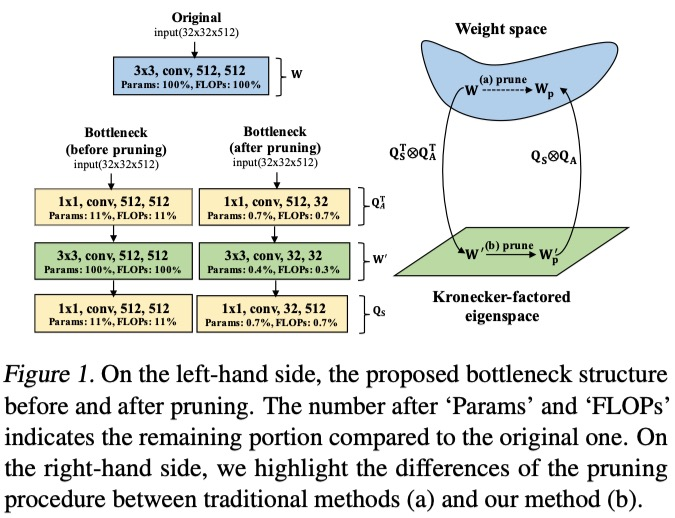

# EigenDamage: Structured Pruning in the Kronecker-Factored Eigenbasis
This repo contains the official implementations of [EigenDamage: Structured Pruning in the Kronecker-Factored Eigenbasis](https://arxiv.org/abs/1905.05934). Details are listed below:
 

1. The config file for the experiments are under the directory of `configs/`.
2. The pruning algorithms are in `pruner/`. Please note that: <br>
   (1) `fisher_diag_pruner.py` implements `C-OBD`. <br>
   (2) `kfac_eigen_pruner.py` implements `EigenDamage`. <br>
   (3) `kfac_full_pruner.py` implements `C-OBS`. <br>
   (4) `kfac_OBD_F2.py` implements `kron-OBD`. <br>
   (5) `kfac_OBS_F2.py` implements `kron-OBS`. <br>
   (6) `kfac_eigen_svd_pruner.py` implements `EigenDamage Depthwise Separable`.
<br>

# Requirements
Python3.6, Pytorch 0.4.1
```
pip install https://download.pytorch.org/whl/cu90/torch-0.4.1-cp36-cp36m-linux_x86_64.whl
pip install torchvision
pip install tqdm
pip install tensorflow
pip install tensorboardX
pip install easydict
pip install scikit-tensor
```

# Dataset
1. Download tiny imagenet from "https://tiny-imagenet.herokuapp.com", and place it in ../data/tiny_imagenet.
   Please make sure there will be two folders, `train` and `val`,  under the directory of `../data/tiny_imagenet`.
   In either `train` or `val`, there will be 200 folders storing the images of each category.
   
2. For cifar datasets, it will be automatically downloaded.


# How to run?

#### 1. Pretrain model
You can also download the pretrained model from `https://drive.google.com/file/d/1hMxj6NUCE1RP9p_ZZpJPhryk2RPU4I-_/view?usp=sharing`.
```
# for pretraining CIFAR10/CIFAR100
$ python main_pretrain.py --learning_rate 0.1 --weight_decay 0.0002 --dataset cifar10 --epoch 200

# for pretraining Tiny-ImageNet
$ python main_pretrain.py --learning_rate 0.1 --weight_decay 0.0002 --dataset tiny_imagenet --epoch 300
```


#### 2. Pruning
```
# for pruning with EigenDamage, CIFAR10, VGG19 (one pass)
$ python main_prune.py --config ./configs/exp_for_cifar/cifar10/vgg19/one_pass/base/kfacf_eigen_base.json

# for pruning with EigenDamage, CIFAR100, VGG19
$ python main_prune.py --config ./configs/exp_for_cifar/cifar100/vgg19/one_pass/base/kfacf_eigen_base.json

# for pruning with EigenDamage, TinyImageNet, VGG19
$ python main_prune.py --config ./configs/exp_for_tiny_imagenet/tiny_imagenet/vgg19/one_pass/base/kfacf_eigen_base.json

# for pruning with EigenDamage + Depthwise separable, CIFAR100, VGG19
$ python main_prune_separable.py --config ./configs/exp_for_svd/cifar100/vgg19/one_pass/base/svd_eigendamage.json
```

# Contact
If you have any questions or suggestions about the code or paper, please do not hesitate to contact with Chaoqi Wang(`alecwangcq@gmail.com` or `cqwang@cs.toronto.edu`)
and Guodong Zhang(`gdzhang.cs@gmail.com` or `gdzhang@cs.toronto.edu`). 

# Citation
To cite this work, please use
```
@InProceedings{wang2019eigen,
  title = 	 {{E}igen{D}amage: Structured Pruning in the {K}ronecker-Factored Eigenbasis},
  author = 	 {Wang, Chaoqi and Grosse, Roger and Fidler, Sanja and Zhang, Guodong},
  booktitle = 	 {Proceedings of the 36th International Conference on Machine Learning},
  pages = 	 {6566--6575},
  year = 	 {2019},
  volume = 	 {97},
  publisher = {PMLR},
  pdf = 	 {http://proceedings.mlr.press/v97/wang19g/wang19g.pdf},
  url = 	 {http://proceedings.mlr.press/v97/wang19g.html},
}

```
